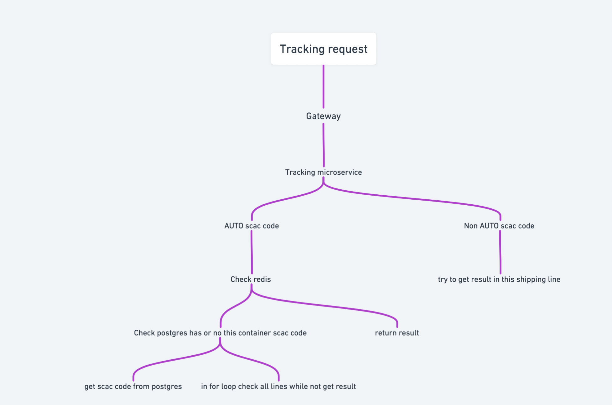

# Find my cargo backend

## Structure

Now structure of project looks like:

Project has microservice architecture, user GRPC for connect microservices.

### Components and how it works

- gateway
- tracking
- freight parser (in progress)
- schedule tracking
- user api

#### Gateway

A gateway is an upper-level "connector" for all microservices. It uses golang-gin for http requests. He also has swagger
documentation. For each microservice, a client adapter is written that does not use a protobuff structure in order to
avoid direct dependence on the GRPC.

#### Tracking

A tracking is "core" of this project. It tracks containers or bill numbers, user TypeScript, Redis and Postgres. It uses
SCAC codes and numbers for get result of tracking. Scac code is world code of shipping line. Support of lines and other
information you can check in [link](https://github.com/frozosea/fmc/tree/master/container-tracking/README.md).

Tracking steps looks like this:

#### Freight parser

In progress...

#### Schedule tracking

Schedule tracking microservice is realization of scheduled tracking tasks. It uses custom written schedule tasks
executor. It depends on user api and tracking api, because it uses tracking api for tracking and user api for mark
containers or bills.

Add on track steps:

#### User api

User api has auth part and other "User" part. Account possibility:

- Add container/bill number to your account
- Delete container/bill number from your account

## Deployment 

You can use docker swarm for deploy, k8s not ready yet, for get instruction go to the [link](https://github.com/frozosea/fmc/tree/master/deployment/swarm/Readme.md)